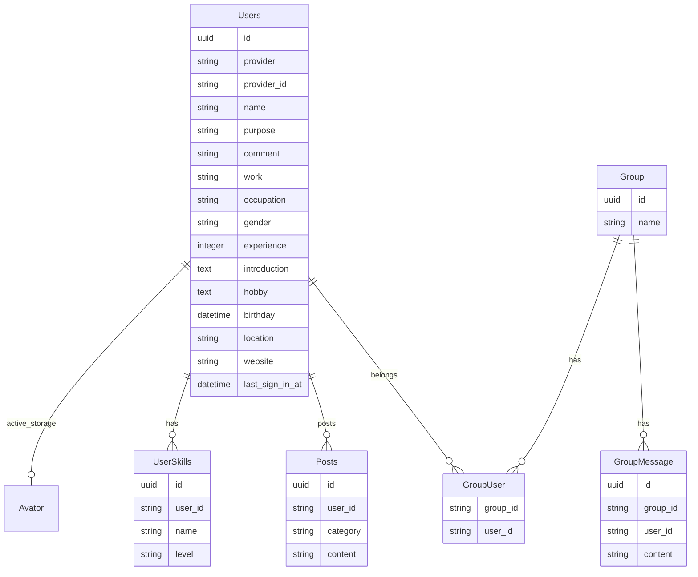

# Engineer-db backend

## プロジェクトの概要
エンジニアのつながりを促進するサービス「エンジニアDB」のバックエンド（API）です。

プロダクトの詳細は、こちらの記事を参照ください。
https://qiita.com/hiiragiya/private/69ef1a3556cb63290d13

## 使用技術一覧

詳細は上記記事を参照ください。

## スタートガイド
Dockerが必要です。

### 環境変数を設定
`.env`ファイルを作成し、下記を設定してください。
| 変数名                 | 役割                                      | DEV 環境での値                           |
| ---------------------- | ----------------------------------------- | ---------------------------------------- |
| FRONTEND_ENDPOINT    | フロントエンド（ローカル）のエンドポイント | http://localhost:8000    |
| NEXTAUTH_SECRET       | フロントエンドと共通のkeyを設定   | hgoehoge   |
| AWS_S3_BUCKET_NAME     | Active-strageの保存場所になるS3のバケット名 | ご自身で取得(未設定だとlocal)      |
| AWS_ACCESS_KEY_ID     | S3用のkeyのid | ご自身で取得      |
| AWS_SECRET_ACCESS_KEY     |  S3用のkeyのpassword | ご自身で取得      |

### コンテナ（サーバー）を起動
~~~
docker compose up --build
docker compose run api rails db:create
docker compose run api rails db:migrate
~~~

### 開発でよく使うコマンド
| コマンド                 | 処理                       |
| ---------------------- | -------------------------- |
| docker compose up | コンテナ起動します。 |
| docker compose run api rails db:create | データベースを作成します。 |
| docker compose run api rails db:migrate | データベースのマイグレーションを実行します。 |
| docker compose run api rails db:seed | データベースに初期データを投入します。 |
| docker compose run api bundle install | 必要なgemをインストールします。 |
| docker compose run api bundle exec rubocop -A | コードの静的解析と自動修正を行います。 |
| docker compose run api rails c | Railsコンソールを起動します。 |
| docker compose run api rails spec | テストスイートを実行します。 |

## DB設計

## その他

採用している技術、ライブラリ、開発環境の詳細、テスト仕様はこちらをご参照ください。
https://qiita.com/hiiragiya/private/69ef1a3556cb63290d13#5%E3%83%90%E3%83%83%E3%82%AF%E3%82%A8%E3%83%B3%E3%83%89%E3%81%AB%E3%81%A4%E3%81%84%E3%81%A6