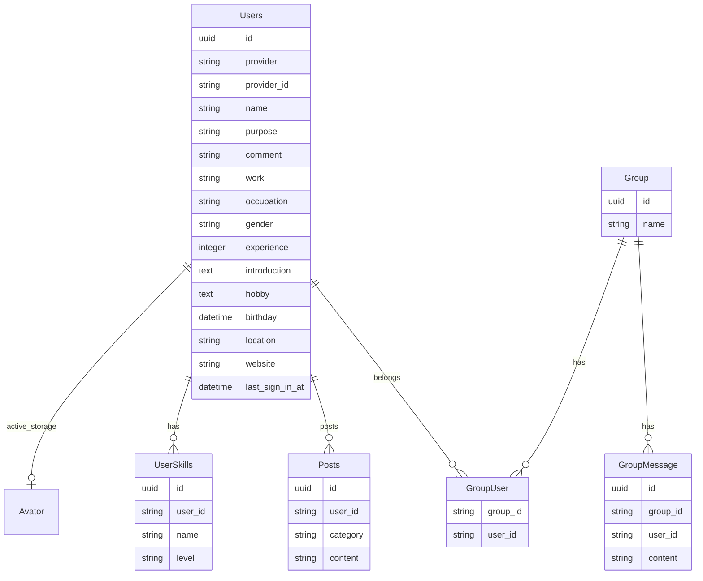

# Engineer-db backend

## プロジェクトの概要
エンジニアのつながりを促進するサービス「エンジニアDB」のバックエンド（API）です。

プロダクトの詳細は、こちらの記事を参照ください。
https://qiita.com/hiiragiya/private/69ef1a3556cb63290d13

## 使用技術一覧

- フレームワーク
  - Ruby on Rails
- 主要なgem
  - rack-cors
  - active_model_serializers
  - aws-sdk-s3
  - jwt
- テスト用のgem
  - rubocop
  - rspec-rails
  - factory_bot_rails
  - faker
  - shoulda-matchers

詳細は後述しています。

## スタートガイド
Dockerが必要です。

### 環境変数を設定
`.env`ファイルを作成し、下記を設定してください。
| 変数名                 | 役割                                      | DEV 環境での値                           |
| ---------------------- | ----------------------------------------- | ---------------------------------------- |
| FRONTEND_ENDPOINT    | フロントエンド（ローカル）のエンドポイント | http://localhost:8000    |
| NEXTAUTH_SECRET       | フロントエンドと共通のkeyを設定   | hgoehoge   |
| AWS_S3_BUCKET_NAME     | Active-strageの保存場所になるS3のバケット名 | ご自身で取得(未設定だとlocal)      |
| AWS_ACCESS_KEY_ID     | S3用のkeyのid | ご自身で取得      |
| AWS_SECRET_ACCESS_KEY     |  S3用のkeyのpassword | ご自身で取得      |

### コンテナ（サーバー）を起動
~~~
docker compose up --build
docker compose run api rails db:create
docker compose run api rails db:migrate
~~~

### 開発でよく使うコマンド
| コマンド                 | 処理                       |
| ---------------------- | -------------------------- |
| docker compose up | コンテナ起動します。 |
| docker compose run api rails db:create | データベースを作成します。 |
| docker compose run api rails db:migrate | データベースのマイグレーションを実行します。 |
| docker compose run api rails db:seed | データベースに初期データを投入します。 |
| docker compose run api bundle install | 必要なgemをインストールします。 |
| docker compose run api bundle exec rubocop -A | コードの静的解析と自動修正を行います。 |
| docker compose run api rails c | Railsコンソールを起動します。 |
| docker compose run api rails spec | テストスイートを実行します。 |

## DB設計

## 技術的なこと
使っているフレームワークや主要なgem、テスト手法について記述していきます。

### フレームワーク
Ruby on Rails7　のAPIモードで実装しています。
前述の通り、スクールから指定があったので採用しています。特に採用理由などは書きません。

### gem
特殊なものは採用しておらず、あまり説明することがないです。
下記のような、多くの人から支持されているgemを採用しています。

#### active_model_serializers
APIのレスポンスボディを構成するために、採用しました。

#### aws-sdk-s3
Active Storageの保存先を、S3に設定するために採用しました。

### テスト
 テスト戦略として、RuboCopによる静的解析でコードの品質を保ち、モデルスペックでバリデーションやアソシエーションの正確性を確認しています。さらに、リクエストスペックを用いてAPIの結合テストを行い、システム全体の動作を保証しています。
 
#### モックデータの作成
モックデータの作成には『factory_bot_rails』と『faker』を使用しています。これらのgemにより、テスト用のリアルなデータセットを容易に生成でき、テストの正確性と効率を大幅に向上させています。

#### モデルの単体テスト
shoulda-matchersというgem使っています。 バリデーションテストなどを１行で記述できるようになので楽になります。

モデルスペックでは、バリデーション、アソシエーション、メソッドのテストを実施しています。 

#### APIの結合テスト
ユースケースに基づいて、正常系と異常系の動作を確認しています。

正常系は、レスポンスのステータスとボディの確認をしています。
異常系は、認証エラー、not found、リクエストパラメータのバリデーションなどを確認しています。

参考: https://qiita.com/KNR109/items/fe331069c4f958efbd96

### 開発で工夫したところ

- 開発面では、Rails Wayに従い、MVCアーキテクチャを厳守し、DRY原則を適用してコードの重複を避けるようにしています。
- パフォーマンス面では、n+1問題、データアクセス回数、メモリ使用量などに注意して実装しています。

参考: https://zenn.dev/yukito0616/articles/d3b7032e9f1e90
