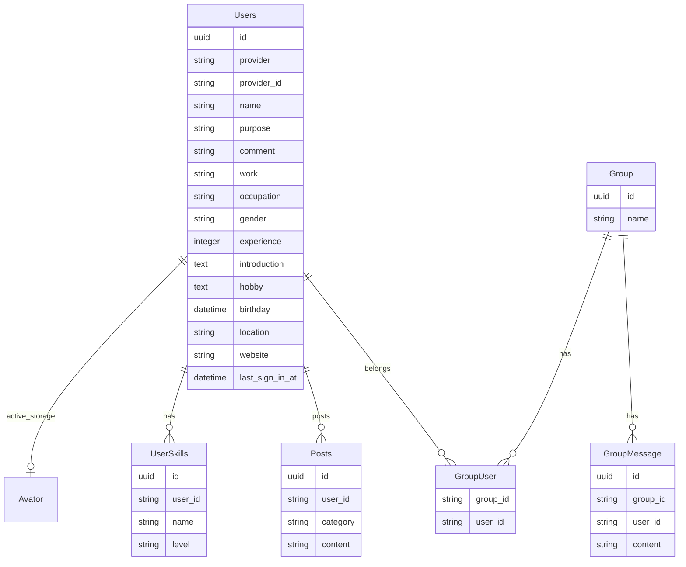

# エンジニアDBのバックエンド

## 技術スタック
Happiness Chainで学んだものを主に使用

### フレームワーク
Ruby on Railsのapiモードで実装しています。
基本に忠実に実装しています。
- モデルには、データのCRUD操作やバリデーションやビジネスロジックを記述しています。
- コントローラーには、クライアントからのリクエストを受け取り、適切なモデルを呼び出してデータを操作し、結果をクライアントに返すように記述しています。
- メモリ使用量やデータアクセス、n+1問題などのパフォーマンスに関わることや、認証認可のセキュリティに関することに配慮して実装しています。
- DRYの原則

## テストについて
モデルスペックにのモデルの単体テストと、リクエストスペックにapiの結合テストを実装しています。

モデルスペックでは、バリデーション、アソシエーション、メソッドのテストを行います。
結合テストでは、ユースケースに基づいて、正常系と異常系の動作を確認します。
正常系は、レスポンスのステータスとボディの確認をしています。
異常系は、認証エラー、not found、リクエストパラメータのバリデーションなどを確認しています。

こだわった点は特にないですが、基本に忠実に、各テストの粒度やコーディングスタイルを揃えることには気をつけました。

###　モックデータ
factory_bot_railsとfakerを使っています。
spec/factories/**

### 単体テスト
shoulda-matchersを使っています。
spec/models/**

###　結合テスト
spec/request/**

参考
- [【入門】Rails APIのテスト手法まとめ](https://qiita.com/KNR109/items/fe331069c4f958efbd96)

## DB設計

## ポイント

- 基本に忠実に実装すること

## 課題・やりたいこと

- 利用者が増えてきたときにパフォーマンスチューニングをしてみたいなぁと思っています。

## 開発者向けて
 ## 使用するコマンド
- docker compose run api bundle exec rubocop -A
- docker compose run api bundle install
- docker compose run api rails db:create
- docker compose run api rails db:migrate
