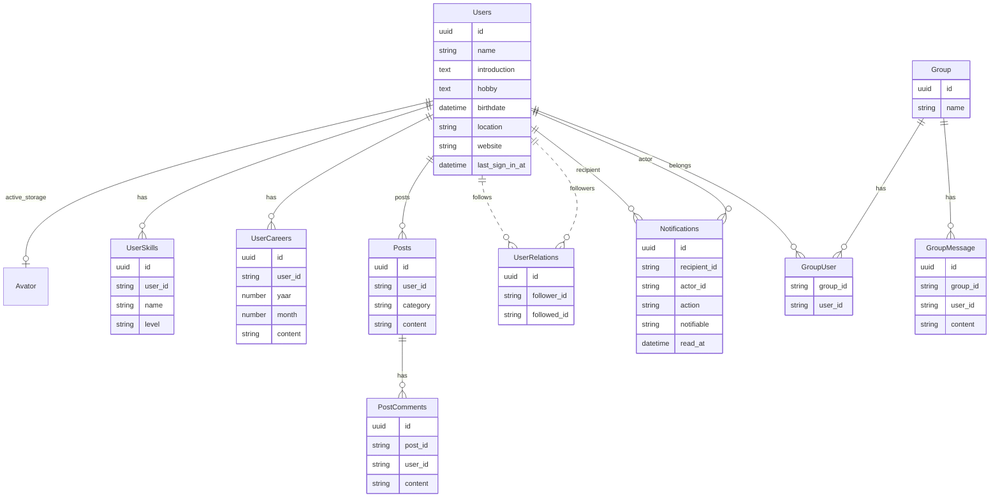

```mermaid
erDiagram
  Users {
    uuid id
    string name
    text introduction
    text hobby
    datetime birthdate
    string location
    string website
    datetime last_sign_in_at
  }

  UserSkills {
    uuid id
    string user_id
    string name
    string level
  }

  UserCareers {
    uuid id
    string user_id
    number yaar
    number month
    string content
  }

  Posts {
    uuid id
    string user_id
    string category
    string content
  }

  PostComments {
    uuid id
    string post_id
    string user_id
    string content
  }

  UserRelations {
    uuid id
    string follower_id
    string followed_id
  }

  Notifications {
    uuid id
    string recipient_id
    string actor_id
    string action
    string notifiable
    datetime read_at
  }

  Group {
    uuid id
    string name
  }

  GroupUser {
    string group_id
    string user_id
  }

  GroupMessage {
    uuid id
    string group_id
    string user_id
    string content
  }


Users ||--o| Avator : "active_storage"
Users ||--o{ UserSkills : has
Users ||--o{ UserCareers : has
Users ||--o{ Posts : posts
Posts ||--o{ PostComments : has
Users ||..o{ UserRelations : follows
Users ||..o{ UserRelations : followers
Users ||--o{ Notifications : recipient
Users ||--o{ Notifications : actor
Users ||--o{ GroupUser : belongs
Group ||--o{ GroupUser : has
Group ||--o{ GroupMessage : has
```
